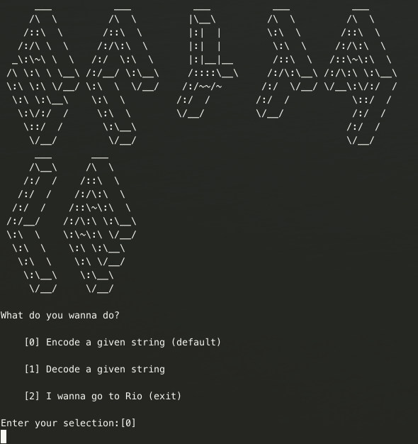

# Description

The scytale was used more than 2500 years ago by the Spartans, and is one example of ancient cryptography.
A message gets written on a ribbon which is then wrapped around a stick with a certain diameter (the scytale).

Below is a sample encryption of the plaintext "prove me wrong!" with a scytale of diameter 3.

We write the messagearound the scytale, and then

```
|p|r|o|
 - - -
|v|e| |
 - - -
|m|e| |
 - - -
|w|r|o|
 - - -
|n|g|!|
```

The ciphertext is obtained by reading from top to bottom, left to right. In this example, the ciphertext is

```
pvmwnreergo  o!
```

## Task 1

Write a short program that encodes a given string with given diameter of the scytasle.

## Task 2

Write a short program that decodes a given encrypted string with given diameter of the scytale.

# Usage of implemented solution

- `cd` in main folder
- `pipenv install` (installs the virtual environment and all given requirements)
- `pipenv shell` (activates and enters the virtual environment)
- `python test_scytale.py` (runs all tests)
- `python scytale.py` (runs the implemented interactive scytale wizard)

